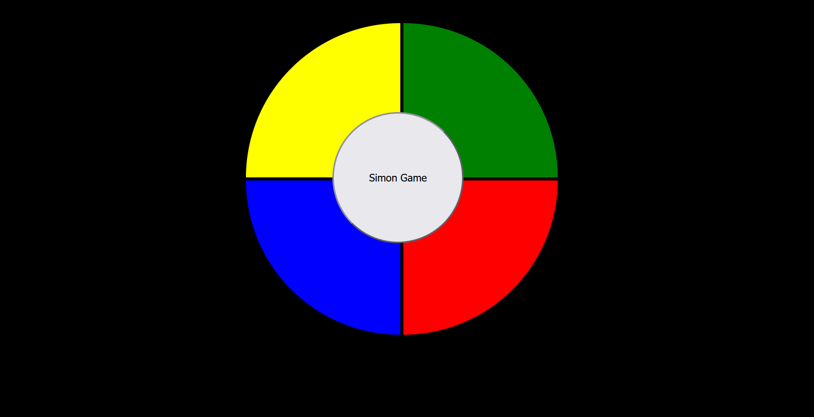

# Simon-Game
this is sequence game very interesting and creative 

🎮 Simon Game

A simple implementation of the classic **Simon Game** built using **HTML, CSS, and JavaScript**.

## 📸 Screenshot

## 🚀 Features
- Four colored panels (Yellow, Green, Blue, Red)
- Panels flash in a sequence to remember
- User clicks panels to repeat the sequence
- Sequence grows by one each round
- Alerts **Game Over** on a wrong click
- Restart button in the center

## 🛠️ Technologies Used
- **HTML5** → Structure of the game
- **CSS3** → Styling, panel colors, active state flashing
- **JavaScript (ES6)** → Game logic, sequence generation, user interaction

## 📂 Project Structure
simon-game/
│── index.html # Main HTML file
│── style.css # Styling for panels and layout
│── index.js # Game logic (sequence, flash, clicks)
│── simongame.png # Screenshot of the game

markdown
Copy code

## 🎯 How to Play
1. Click the **"Simon Game"** button to start.
2. Watch the panels flash in a sequence.
3. Repeat the same sequence by clicking the panels.
4. Each round adds one more panel to the sequence.
5. A wrong click ends the game with a "Game Over" alert.

## ▶️ Run Locally
1. Clone or download this repository.
2. Open `index.html` in your browser.
3. Enjoy playing 🎉

## 🧑‍💻 Author
- Developed by **Aishwarya Santosh Shinde**
